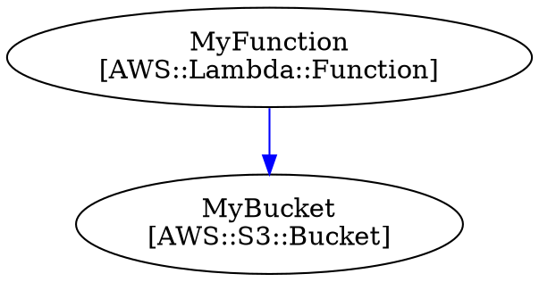
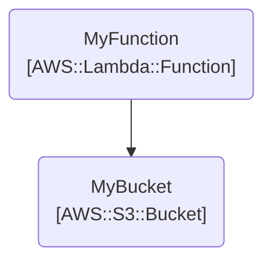

# CLI Reference

The `wetwire-aws` command provides tools for generating and validating CloudFormation templates from Go code.

## Quick Reference

| Command | Description |
|---------|-------------|
| `wetwire-aws build` | Generate CloudFormation template from Go source |
| `wetwire-aws lint` | Lint code for issues |
| `wetwire-aws init` | Initialize a new project |
| `wetwire-aws import` | Import CloudFormation template to Go code |
| `wetwire-aws design` | AI-assisted infrastructure design |
| `wetwire-aws test` | Run automated persona-based testing |
| `wetwire-aws validate` | Validate resources and references |
| `wetwire-aws list` | List discovered resources |
| `wetwire-aws graph` | Generate DOT/Mermaid dependency graph |

```bash
wetwire-aws --help     # Show help
```

---

## build

Generate CloudFormation template from Go source files.

```bash
# Generate JSON to stdout
wetwire-aws build ./infra > template.json

# Generate YAML format
wetwire-aws build ./infra --format yaml > template.yaml

```

### Options

| Option | Description |
|--------|-------------|
| `PATH` | Directory containing Go source files |
| `--format, -f {json,yaml}` | Output format (default: json) |
| `--output, -o FILE` | Output file (default: stdout) |

### How It Works

1. Parses Go source files using `go/ast`
2. Discovers `var X = Type{...}` resource declarations
3. Extracts resource dependencies from intrinsic references
4. Orders resources topologically by dependencies
5. Detects SAM resources and adds Transform header if needed
6. Generates CloudFormation JSON or YAML

### Output Modes

**JSON (default):**
```json
{
  "AWSTemplateFormatVersion": "2010-09-09",
  "Resources": {
    "DataBucket": {
      "Type": "AWS::S3::Bucket",
      "Properties": { "BucketName": "my-data" }
    }
  }
}
```

**YAML:**
```yaml
AWSTemplateFormatVersion: '2010-09-09'
Resources:
  DataBucket:
    Type: AWS::S3::Bucket
    Properties:
      BucketName: my-data
```

**SAM Template (when SAM resources detected):**
```yaml
AWSTemplateFormatVersion: '2010-09-09'
Transform: AWS::Serverless-2016-10-31
Resources:
  HelloFunction:
    Type: AWS::Serverless::Function
    Properties:
      Handler: bootstrap
      Runtime: provided.al2
```

---

## lint

Lint wetwire-aws code for issues.

```bash
# Lint a directory
wetwire-aws lint ./infra

# Lint a single file
wetwire-aws lint ./infra/storage.go
```

### Options

| Option | Description |
|--------|-------------|
| `PATH` | File or directory to lint |

### What It Checks

1. **Resource discovery**: Validates resources can be parsed from source
2. **Reference validity**: Checks that referenced resources exist
3. **Type correctness**: Validates resource types are valid CloudFormation types

### Output Examples

**Linting passed:**
```
Linting passed: 5 resources OK
```

**Issues found:**
```
./infra/storage.go:15: undefined resource reference: MissingBucket
./infra/compute.go:23: unknown resource type: AWS::Invalid::Type
```

### Lint Rules

| Rule | Description |
|------|-------------|
| WAW001 | Use pseudo-parameter constants (`AWS_REGION` not `"AWS::Region"`) |
| WAW002 | Use intrinsic types instead of `map[string]any` |
| WAW003 | Detect duplicate resource variable names |
| WAW004 | Flag files with too many resources (>20) |
| WAW005 | Extract inline property types to named variables |
| WAW006 | Use typed policy document structs |
| WAW007 | Use typed slices instead of `[]any` |
| WAW008 | Use named var declarations |
| WAW009 | Use typed structs instead of `map[string]any` |
| WAW010 | Flatten inline typed struct literals |
| WAW011 | Validate enum property values |
| WAW012 | Use typed enum constants |
| WAW015 | Avoid explicit `Ref{}` — use direct references |
| WAW016 | Avoid explicit `GetAtt{}` — use `.Attr` field access |
| WAW017 | Avoid pointer assignments |
| WAW018 | Use `Json{}` instead of `map[string]any{}` |

---

## init

Initialize a new wetwire-aws project.

```bash
# Create a new project
wetwire-aws init myapp
```

### Arguments

| Argument | Description |
|----------|-------------|
| `project-name` | Name/path for the new project (required) |

### Generated Structure

```
myapp/
├── go.mod
├── main.go
├── .gitignore
└── infra/
    └── resources.go
```

**main.go:**
```go
package main

import (
    "fmt"

    _ "myapp/infra" // Register resources
)

func main() {
    fmt.Println("Run: wetwire-aws build ./infra/...")
}
```

**infra/resources.go:**
```go
package infra

import (
    "github.com/lex00/wetwire-aws-go/resources/s3"
    // ... other common imports
)

// Example bucket - uncomment and modify:
// var MyBucket = s3.Bucket{
//     BucketName: "my-bucket",
// }
```

---

## Typical Workflow

### Development

```bash
# Lint before generating
wetwire-aws lint ./infra

# Generate template
wetwire-aws build ./infra > template.json

# Preview YAML format
wetwire-aws build ./infra --format yaml
```

### CI/CD

```bash
#!/bin/bash
# ci.sh

# Lint first
wetwire-aws lint ./infra || exit 1

# Generate template
wetwire-aws build ./infra > template.json

# Deploy with AWS CLI
aws cloudformation deploy \
  --template-file template.json \
  --stack-name myapp \
  --capabilities CAPABILITY_IAM
```

---

## Intrinsic Functions

All CloudFormation intrinsic functions are supported. **Prefer direct references over explicit intrinsics:**

| Function | Preferred Style | Alternative |
|----------|-----------------|-------------|
| Ref (resource) | `MyBucket` | Direct variable reference |
| Ref (parameter) | `Param("VpcId")` | Helper function |
| GetAtt | `MyBucket.Arn` | Field access on resource |
| Sub | `Sub{String: "${AWS::StackName}-bucket"}` | - |
| SubWithMap | `SubWithMap{String: "...", Variables: Json{...}}` | - |
| Join | `Join{Delimiter: ",", Values: []any{"a", "b"}}` | - |
| If | `If{Condition: "IsProd", IfTrue: val1, IfFalse: val2}` | - |
| Equals | `Equals{Value1: x, Value2: y}` | - |
| And/Or/Not | `And{Conditions: []any{...}}` | - |
| FindInMap | `FindInMap{MapName: "...", TopKey: "...", SecondKey: "..."}` | - |
| Select | `Select{Index: 0, List: GetAZs{}}` | - |
| Split | `Split{Delimiter: ",", Source: "a,b,c"}` | - |
| Base64 | `Base64{Value: "Hello"}` | - |
| Cidr | `Cidr{IPBlock: "10.0.0.0/16", Count: 256, CidrBits: 8}` | - |
| GetAZs | `GetAZs{}` or `GetAZs{Region: "us-east-1"}` | - |
| ImportValue | `ImportValue{ExportName: "Value"}` | - |

**Note:** Use dot import for cleaner syntax: `import . "github.com/lex00/wetwire-aws-go/intrinsics"`

---

## Pseudo-Parameters

Built-in CloudFormation pseudo-parameters:

```go
import "github.com/lex00/wetwire-aws-go/intrinsics"

// Available pseudo-parameters
intrinsics.AWS_REGION        // {"Ref": "AWS::Region"}
intrinsics.AWS_ACCOUNT_ID    // {"Ref": "AWS::AccountId"}
intrinsics.AWS_STACK_NAME    // {"Ref": "AWS::StackName"}
intrinsics.AWS_STACK_ID      // {"Ref": "AWS::StackId"}
intrinsics.AWS_PARTITION     // {"Ref": "AWS::Partition"}
intrinsics.AWS_URL_SUFFIX    // {"Ref": "AWS::URLSuffix"}
intrinsics.AWS_NO_VALUE      // {"Ref": "AWS::NoValue"}
```

Usage:
```go
import . "github.com/lex00/wetwire-aws-go/intrinsics"

var MyBucket = s3.Bucket{
    BucketName: Sub{String: "${AWS::StackName}-data"},
}
```

---

## design

AI-assisted infrastructure design. Starts an interactive session where you describe infrastructure in natural language and the AI generates wetwire-aws Go code.

**Providers:**
- `anthropic` (default) - Uses Anthropic API directly. Requires `ANTHROPIC_API_KEY`.
- `kiro` - Uses Kiro CLI with wetwire-runner agent. See [Kiro CLI Integration](AWS-KIRO-CLI.md).

```bash
# Start design session with a prompt
wetwire-aws design "Create a serverless API with Lambda and API Gateway"

# Specify output directory
wetwire-aws design -o ./myproject "Create an S3 bucket with encryption"

# Disable streaming for batch output
wetwire-aws design -s=false "Create a VPC with public and private subnets"
```

### Options

| Option | Description |
|--------|-------------|
| `prompt` | Natural language description of infrastructure (required) |
| `--provider` | AI provider: `anthropic` or `kiro` (default: `anthropic`) |
| `-o, --output` | Output directory (default: `.`) |
| `-l, --max-lint-cycles` | Maximum lint/fix cycles before giving up (default: 3) |
| `-s, --stream` | Stream AI responses to terminal (default: true) |

### How It Works

The `design` command uses the `wetwire-core-go` runner agent to orchestrate an AI-driven workflow:

1. **Clarification**: AI asks questions about your requirements (reads from stdin)
2. **Code Generation**: Generates Go code using wetwire-aws patterns
3. **Lint Cycle**: Runs `wetwire-aws lint` and auto-fixes issues (up to `--max-lint-cycles`)
4. **Build**: Runs `wetwire-aws build` to generate CloudFormation template
5. **Validation**: Validates template with `cfn-lint-go` library

Press `Ctrl+C` to stop the session at any time.

### Output

On completion, prints a summary:
- List of generated files
- Number of lint cycles required
- Whether linting passed

### Agent Prompt

Copy this prompt to have your AI coding assistant (Claude Code, Cursor, etc.) run the design session for you:

```
Run `wetwire-aws design` for me interactively. When the AI asks clarifying questions, show them to me and relay my answers back. Continue until the infrastructure code is generated and validated.
```

---

## test

Run automated persona-based testing to evaluate AI code generation quality. Unlike `design`, this command uses an AI persona to simulate user responses instead of reading from stdin.

**Requires:** `wetwire-core-go` (AI orchestration) and an Anthropic API key in `ANTHROPIC_API_KEY`.

```bash
# Run with default persona (intermediate)
wetwire-aws test "Create an S3 bucket with versioning"

# Use a specific persona
wetwire-aws test --persona beginner "Create a Lambda function"

# Track test scenario and stream output
wetwire-aws test --scenario "s3-encryption" --stream "Create encrypted bucket"
```

### Personas

Personas simulate different user skill levels and communication styles:

| Persona | Description |
|---------|-------------|
| `beginner` | New to AWS, asks many clarifying questions |
| `intermediate` | Familiar with AWS basics (default) |
| `expert` | Deep AWS knowledge, asks advanced questions |
| `terse` | Gives minimal responses |
| `verbose` | Provides detailed context |

### Options

| Option | Description |
|--------|-------------|
| `prompt` | Infrastructure description to test (required) |
| `-p, --persona` | Persona to use (default: `intermediate`) |
| `-S, --scenario` | Scenario name for tracking/reporting (default: `default`) |
| `-o, --output` | Output directory (default: `.`) |
| `-l, --max-lint-cycles` | Maximum lint/fix cycles (default: 3) |
| `-s, --stream` | Stream AI responses to terminal (default: false) |

### How It Works

The `test` command runs the same workflow as `design`, but replaces human input with AI-simulated responses:

1. **AI Developer**: A second AI (the "developer persona") responds to clarifying questions
2. **Code Generation**: Runner agent generates wetwire-aws Go code
3. **Lint Cycle**: Runs `wetwire-aws lint` with auto-fix
4. **Build**: Generates CloudFormation template
5. **Validation**: Validates with `cfn-lint-go`
6. **Results**: Writes session results to output directory

### Output

Writes test results to the output directory and prints:
- Persona and scenario used
- List of generated files
- Number of lint cycles and pass status
- Number of questions asked during session

---

## validate

Validate resources and check dependencies.

```bash
wetwire-aws validate ./infra/...
wetwire-aws validate ./infra/... --format json
```

### Checks Performed

- **Reference validity**: All resource references point to defined resources
- **Dependency graph**: Validates resource dependencies exist

---

## list

List discovered resources in a package.

```bash
wetwire-aws list ./infra/...
```

---

## graph

Generate a DOT or Mermaid format graph showing resource dependencies.

```bash
# Generate DOT format (default)
wetwire-aws graph ./infra

# Render with Graphviz
wetwire-aws graph ./infra | dot -Tpng -o deps.png

# Generate Mermaid format for GitHub markdown
wetwire-aws graph ./infra -f mermaid
```

### Options

| Option | Description |
|--------|-------------|
| `PATH` | Directory containing Go source files |
| `--format, -f {dot,mermaid}` | Output format (default: dot) |
| `--include-parameters, -p` | Include parameter nodes in the graph |
| `--cluster, -c` | Cluster resources by AWS service type |

### Output Formats

**DOT (default):**

Graphviz DOT format for rendering with `dot`, `neato`, etc.



**Mermaid:**

GitHub-compatible format for embedding in markdown.



### Edge Styles

- **Solid black**: `Ref` dependencies
- **Blue**: `GetAtt` dependencies (attribute references)

---

## CloudFormation Validation

The `design` and `test` commands automatically validate generated templates using **cfn-lint-go** (used as a Go library, not a CLI tool). Validation checks for:

- Valid resource types and properties per AWS CloudFormation specification
- Correct intrinsic function usage (Ref, GetAtt, Sub, etc.)
- Best practices and security recommendations
- Required properties and valid enum values

Validation runs after a successful build. Errors fail the workflow; warnings are reported but don't block.

---

## Dependencies

### wetwire-core-go

The `design` and `test` commands require [wetwire-core-go](https://github.com/lex00/wetwire-core-go), which provides:

- **Runner Agent**: Orchestrates the AI-driven code generation workflow
- **Personas**: Simulated user personas for automated testing
- **Session Tracking**: Records questions, responses, and results

Install via go.mod (already included as a dependency).

### cfn-lint-go

CloudFormation template validation uses [cfn-lint-go](https://github.com/lex00/cfn-lint-go) as a **library dependency** (not a CLI tool). This ensures:

- Consistent validation across all wetwire-aws installations
- No external tool installation required
- Version-controlled validation rules

The library validates templates against the official AWS CloudFormation resource specification.

### Anthropic API

The `design` and `test` commands require an Anthropic API key:

```bash
export ANTHROPIC_API_KEY="sk-ant-..."
```

---

## See Also

- [Quick Start](QUICK_START.md) - Create your first project
- [SAM Guide](SAM.md) - Serverless Application Model resources
- [Kiro CLI Integration](AWS-KIRO-CLI.md) - Use Kiro CLI for AI-assisted design
